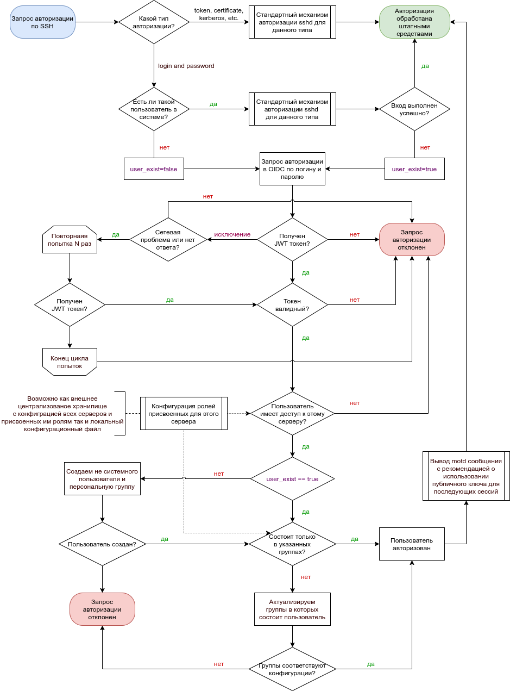
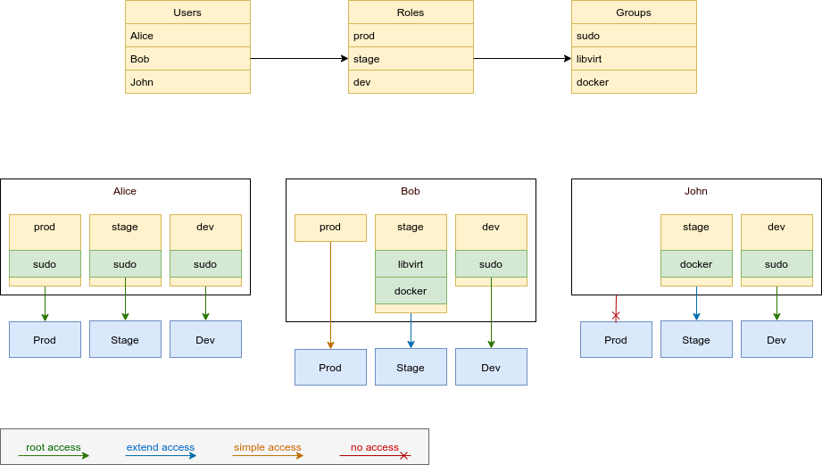

# PAM OIDC (Draft document) <!-- omit in toc -->

> ⚠️ **Внимание!** Это еще не готовое решение, а только проработка логики
> перед реализацией.

Проект для реализации прозрачного входа по SSH на сервер с использованием OIDC
провайдера. Проект не призван обеспечить полное проксирование серверов и не
обязан предоставить возможность отзыва учетных записей с сервера.

* [Альтернативные решения](#альтернативные-решения)
* [Идея](#идея)
  * [Авторизация](#авторизация)
  * [Логика работы](#логика-работы)
  * [Конфигурация](#конфигурация)
  * [CLI Конфигуратор](#cli-конфигуратор)
  * [Поставка пакетов](#поставка-пакетов)
* [Очень отдаленные идеи](#очень-отдаленные-идеи)

Цель проекта, предоставить быстрый доступ к не продуктовым серверам (это на
ваше усмотрение) для разных команд обслуживания и разработки.

Доступ выдается:

* К серверам согласно группировки по ролям, к примеру stage, test, dev;
* Права предоставляются согласно системным группам разрешенным для
  пользователя в роли;

Для разрешения доступа к серверам используются OIDC роли, а для выдачи групп на
сервере используется локальный конфиг или сервер конфигурации (возможно
OIDC если можно)

> ❓ **К изучению** Возможно ли реализовать хранение связи
> _пользователь-роль-группа_ в keycloak

## Альтернативные решения

Имеется несколько альтернатив, блоьшие решения по типу [Teleport][] или
[Boundary][] довольно сложны и требуют дополнительного враппинга SSH клиента или
реализуют собственный протокол подключения, а нам хочется сохранить всю
ванильность SSH и сохранить использование его для проксирования, SCP, запуска
Ansible плейбуков и т.п. Решения в виде PAM модулей не дают возможности маппинга
узлов по ролям, а пользователей по группам, также отсутствует автоматическое
создание учетных записей на узлах.

Несколько альтернативныйх решений:

* [Teleport][] - Есть платная и бесплатная версия, поставляется вместе с веб
  панелью управления, используется отдельный CLI для обертывания SSH;
* HashiCorp [Boundary][] - поставляется вместе с веб
  панелью управления, используется отдельный CLI для обертывания SSH;
* [Signmykey][] - на прямую в хост по LDAP, а для OIDC отдельный сервер
  прокси-бастион используется;
* [StrongDM][] - платная штука с расширенным аудитом;
* [SmallStep][] - используется отдельный CLI для обертывания SSH;
* [pam-oauth2][] - PAM модуль на С;
* [pam-exec-oauth2][] - PAM модуль на Go.
* [pam-keycloak-oidc][] - случайно нашел в глубинах гитхаба, это кажется почти
  то что нужно.

## Идея

Нужно реализовать PAM модуль используя Rust (если не осилю то Go) для работы
с OIDC провайдером, для начала проверить работу с KeyCloak.

Скорее всего понадобятся крейты:

* [pam-sys][] - PAM враппер;
* [pam][] - обертка над [pam-sys][], возможно можно обойстись и без неё;
* [oauth2][] - нормальная реализация OAuth2;
* какой нибудь `requests` или `curl` для похода в
  `.well-known/openid-configuration` за эндпоинтами (также должна быть свободная
  конфигурация на то случай если нет OIDC и есть только сухой OAuth2);
* [users][] - наверное поможет работать с системными пользователями и группами;
* [structopt][] или [clap][] для реализации CLI, сложнее крейты не нужны.

### Авторизация

Авторизуемся обычным SSH клиентом, на сервере установлен наш PAM
модуль, и подключен через конфиг:

* `/etc/pam.d/common-auth` - авторизация возможна не только по SSH, в теории
  можем и в X сессию так войти на рабочем месте.
* `/etc/pam.d/sshd` - авторизация сугубо по SSH.

Примерно с таким содержимым:

```txt
auth sufficient pam_oidc.so expose_authtok /path/to/pam_oidc
```

Если авторизация идет любым другим путем кроме как по логину и паролю, то мы
не вмешиваемся, иначе пробуем войти через OIDC провайдер
(подробнее о логике в следующем разделе).


Конфиг с настройками OIDC храним где-то в /etc или рядом с модулем.

### Логика работы

Идея того как должен работать наш модуль PAM (Pluggable Authentication Modules).

> ❓ **К изучению** Матчасть PAM нормально не изучена, возможно мы не можем
> в процессе авторизации перебрасывать контекст туда и обратно несколько раз,
> следует проработать.



### Конфигурация

Конфигурацию хочется делить на роли (группы серверов) и группы (системные группы на сервере), для этого есть несколько непроверенных идей реализации:

* Хранить все в OIDC - было бы очень круто, но есть сомнения что так гибко
  назначить группы на роли, а роли на пользователей не выйдет.
* Использовать отдельную внешнюю БД или сервис конфигурации.
* Хранить принадлежность сервера к роли локально в конфиге сервера, а группы
  пользователей проставлять в OIDC. С этой реализации пожалуй и начнем, после оставим как опцию.

Пример как может выглядеть логика модуля:



### CLI Конфигуратор

Для начала необходим простой вспомогательный CLI инструмент для возможности
настройки и проверки подключения к OIDC, включения модуля в `/etc/pam.d/*`
конфиг, конфигурации параметров.

Как идея прикрутить задачу синхронизации пользователей из OIDC и удаление
несуществующих УЗ с сервера, только тех что создали модулем, и как опция
`--force` всех не системных пользователей кого нет в OIDC. И дергать этот таск
когда нужно, к примеру по крону.  
Это как один из вариантов решения вопроса о отзыве УЗ с сервера, но ни кто не
отменяет разложеных ssh ключей в root и тому подобных действий, если не подходит
используйте [Teleport][] или [Boundary][]. Мы за прозрачные и нативные сессии и
удобство, а не вот это всё модное-молодежное.

### Поставка пакетов

Модуль выкладываем как блоб а также готовим rpm и deb пакет.

## Очень отдаленные идеи

* Как то научится обрабатывать ssh ключи и тем самым реализовать отзыв УЗ.
* Возможно прикрутить вход по сертификатам.
* Сделать web админку.

<!-- Links creates -->
[pam-sys]: https://crates.io/crates/pam-sys "FFI wrappers for the Linux Pluggable Authentication Modules (PAM)"
[pam]: https://crates.io/crates/pam "Safe Rust wrappers for PAM authentification"
[oauth2]: https://crates.io/crates/oauth2 "An extensible, strongly-typed implementation of OAuth2"
[structopt]: https://crates.io/crates/structopt "Parse command line argument by defining a struct"
[clap]: https://crates.io/crates/clap "A simple to use, efficient, and full-featured Command Line Argument Parser"
[users]: https://crates.io/crates/users "Library for accessing Unix users and groups"
<!-- Links alternatives -->
[Teleport]: https://goteleport.com "Teleport"
[Boundary]: https://boundaryproject.io "HashiCorp Boundary"
[Signmykey]: https://signmykey.io "Signmykey"
[StrongDM]: https://strongdm.com "StrongDM"
[SmallStep]: https://smallstep.com "SmallStep"
[pam-oauth2]: https://github.com/CyberDem0n/pam-oauth2 "pam-oauth2"
[pam-exec-oauth2]: https://github.com/shimt/pam-exec-oauth2 "pam-exec-oauth2"
[pam-keycloak-oidc]: https://github.com/zhaow-de/pam-keycloak-oidc "pam-keycloak-oidc"
